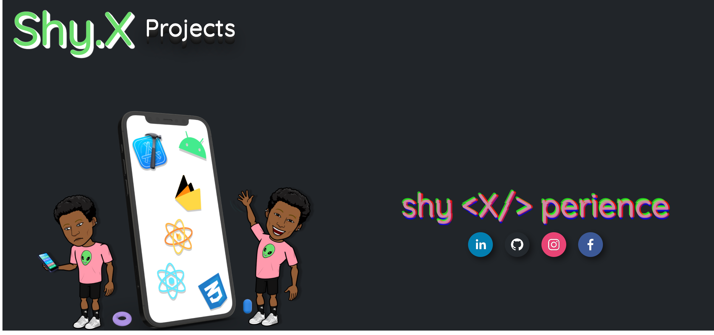

# Portfolio

My Portfolio App inspired by my weird creative taste

## Table of contents

1. Installation
2. Project structure
3. Usage/user story
4. Author
5. Features
6. Tech stack
7. Appendix

## Installation

- clone repo
  ```
      git clone https://github.com/AdamuAbba/myPortfolio.git
  ```
- install dependencies

  ```
      yarn
  ```

- build `locally`

  ```
      yarn run build
  ```

- run `locally`

  ```
      yarn run start
  ```

## Project structure

- Main Route
  - Home Screen
  - Projects Screen

Desktop



Mobile


## User story

- A user can view all projects i have worked on
- A user can reach out to me by using the contact form in the footer

## Author

- [Abba Adamu](https://github.com/AdamuAbba)

## 🔗 Links

<a href="https://www.facebook.com/izshytypes" target="_blank">

</a>
<a href="https://www.instagram.com/shytypes1028/" target="_blank">

</a>
<a href="https://twitter.com/shytypes1028">

</a>
<a href="https://abbaportfolio.netlify.app/"  target="_blank">

</a>
<a href="https://www.linkedin.com/in/abba-adamu/">

</a>

## Features

- simplistic design
- Form state handling with [formik](https://formik.org)
- Form validation with [yup validation](https://github.com/jquense/yup)
- Contact form powered by [email js](https://www.emailjs.com/)
- Simple fluid animations with [framer motion](https://www.framer.com/motion/) animation library
- Lovely animated icons from [Lottie Animations](https://lottiefiles.com/)
- [Redux](https://redux-toolkit.js.org/) state management for global state management
- Dynamic backend data using [sanity.io](https://www.sanity.io/) headless CMS
- Some mild humour from the great CHUCK NORRIS [Chuck Norris API](https://api.chucknorris.io/)

## Tech Stack

**Client:**

         

**Server:** [sanity.io](sanity.io)

## Appendix

**Implementation summary:**

- RTKQuery for accessing api layer with data caching
- Each component is modularized

```
Component "folder level"
│   Component.styles.ts
│   Component.tsx
│   index.tsx

```

- Sanity is an amazing headless CMS and i would encourage developers looking for something secure and robust and easy to set up to take advantage of its awesome features.
